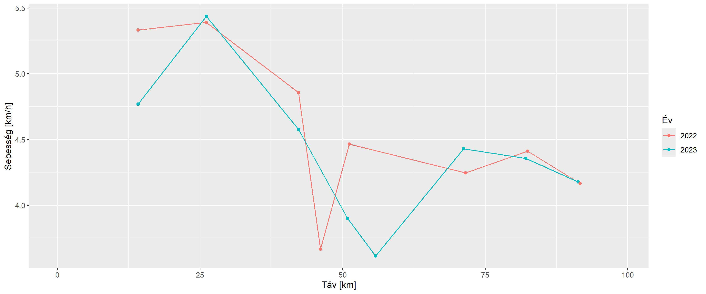
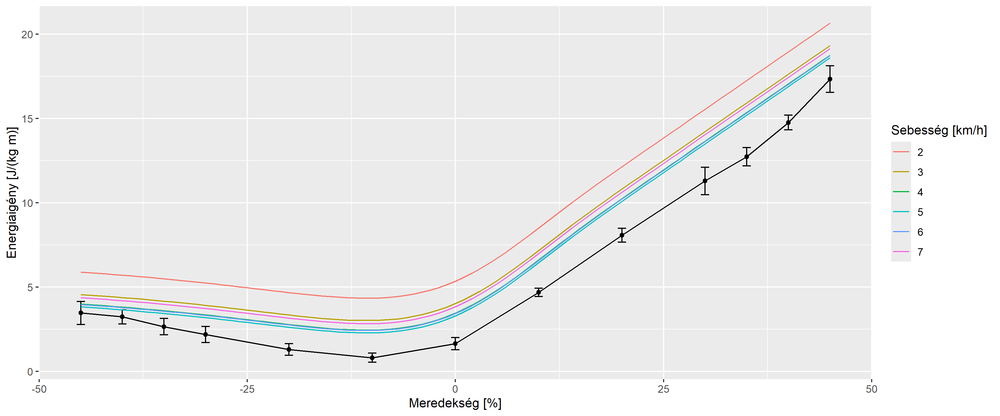
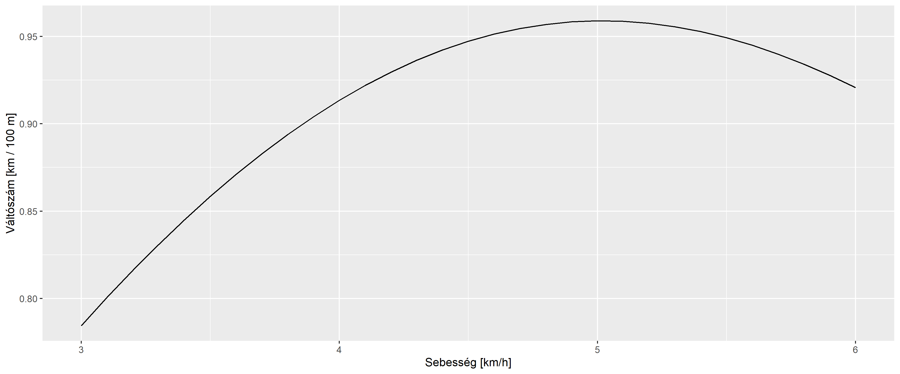
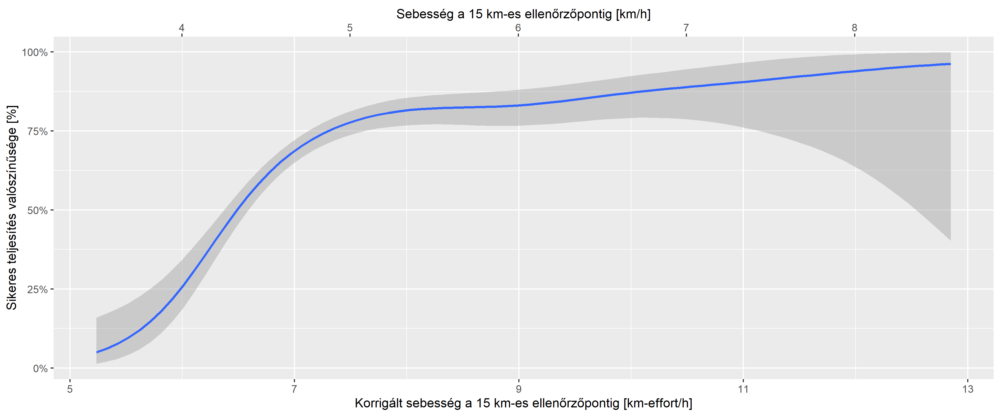
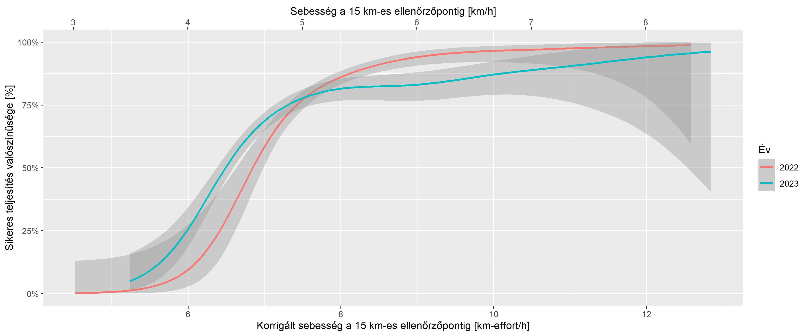

A 2023-as Kinizsi 100 adatainak elemzése
================
Ferenci Tamás (<https://www.medstat.hu/>)

## Bevezető gondolatok

A Kinizsi 100 Magyarország legnagyobb hagyományú – és egyik legkeményebb
– teljesítménytúrája. A feladat egyszerű: 100 km, 24 óra (és nagyjából
3200 méter összesített szintemelkedés). Az útvonalban néha apróbb
változások vannak bizonyos években, de alapvetően budapesti indulás után
átkel a Pilisen majd a Gerecsén. Számos további információ érhető el a
[túra honlapján](http://kinizsi.org/kinizsi-szazas/) és a
[Wikipedián](https://hu.wikipedia.org/wiki/Kinizsi_Sz%C3%A1zas).

Egy évvel ezelőtt elvégeztem a [2022-as
rendezés](https://github.com/tamas-ferenci/K100Statisztika) adatainak
egyfajta elemzését. Mivel az ott leírt módszer szerencsére a 2023-as
rendezésnél is működik, így most közlöm az idei adatok hasonló
vizsgálatát, kiegészítve egy újdonsággal.

A mostani leírás előtt ajánlom a 2022-es anyag elolvasását, mert az
ismétlődő elemzéseknél inkább csak az eredményeket közlöm, részletes
tárgyalás nélkül, bővebben pedig az újdonságot – illetve a két évet
egymással összevető részeket – fejtem most ki.

## Technikai részletek: az adatok letöltése és feldolgozása

Az adatok letöltését és vizsgálatát ezúttal is [R statisztikai
környezet](https://www.youtube.com/c/FerenciTam%C3%A1s/playlists?view=50&sort=dd&shelf_id=2)
alatt végeztem. Szerencsére a tavalyi szkript igazolta jóságát, mert
időtállónak bizonyult: változtatás nélkül lefutott az új adatokon is!
Egyedül a maximális sorszámot és az idei ellenőrzőpontok adatait kellett
átírni.

A kódot így most minden további nélkül, egyben közlöm, hiszen a hozzá
tartozó kommentárok az előbbi megjegyzésnek megfelelően egyeznek [a
tavalyiakkal](https://github.com/tamas-ferenci/K100Statisztika#technikai-r%C3%A9szletek-az-adatok-let%C3%B6lt%C3%A9se-%C3%A9s-feldolgoz%C3%A1sa):

``` r
library(data.table)
library(ggplot2)

if(!file.exists("K100res-2023.rds")) {
  res <- rbindlist(lapply(1:1600, function(i) {
    tab <- rvest::html_table(rvest::read_html(paste0("https://szazas.kinizsi.org/", i)))
    if(length(tab)<=2) NULL else cbind(data.table(t(do.call(cbind, tab[-(1:2)])))[, -2], i)
  }))
  
  res <- res[, .(ID = i, KM = V1, TIME = V3)]
  res$KM <- as.numeric(res$KM)
  
  saveRDS(res, "K100res-2023.rds")
} else res <- readRDS("K100res-2023.rds")

res[, TIME2 := as.numeric(hms::parse_hm(TIME)-hms::parse_hm(TIME)[1]), .(ID)]
res$TIME2 <- ifelse(res$TIME2>=0, res$TIME2, res$TIME2 + 24*60*60)

K100Data2023 <- data.table(KM = c(0, 15, 25, 40, 50, 55, 70, 80, 90, 100),
                           TRUEKM = c(0, 14.15, 26.11, 42.28, 50.86, 55.8,
                                      71.23, 82.12, 91.31, 98.37),
                           TRUEASCENT = c(0, 705, 1090-705, 1519-1090, 1830-1519,
                                          2011-1830, 2621-2011, 2752-2621, 3107-2752,
                                          3117-3107),
                           KMTEXT = c("0", "0-15", "15-25", "25-40", "40-50",
                                      "50-55", "55-70", "70-80", "80-90", "90-100"))

res <- merge(res, K100Data2023, by = "KM", sort = FALSE)

res[, KMDIFF := c(NA, diff(TRUEKM)), .(ID)]
res[, TIMEDIFF := c(NA, diff(TIME2)), .(ID)]
res$SPEED <- res$KMDIFF/(res$TIMEDIFF/(60*60))

res <- merge(res, res[, .(SUCCESS = 100%in%KM), .(ID)], sort = FALSE)

res$YEAR <- 2023
saveRDS(res, "K100res-proc-2023.rds")

res <- rbind(res, readRDS(url(
  "https://github.com/tamas-ferenci/K100Statisztika/raw/main/K100res-proc-2022.rds")))

resWide <- dcast(res, YEAR + ID ~ paste0("SPEED", KM), value.var = "SPEED")[, -c("SPEED0", "SPEED100")]
resWide <- merge(resWide, res[, .(SUCCESS = 100%in%KM), .(YEAR, ID)], sort = FALSE)
```

Az egyetlen újdonság az, hogy az – évszámmal kiegészített – feldolgozott
táblát is elmentem. Így könnyebb a tavalyi évvel való összekapcsolás, ha
arról is megvan a hasonló tábla (ez a fenti kódban meg is történik).

## A feladások vizsgálata

A tényleges indulók száma 2023-ban 1317 fő volt, közülük 893
teljesítette sikeresen a túrát; ez 67.8%-os arány.

Érdekes megnézni, hogy a túrát feladók hol szálltak ki! Az alábbi ábra
mutatja az egyes szakaszokon a túrát feladók számát (tehát ennyien
haladtak át időben a szakasz kezdőellenőrzőpontján, de nem a zárón):

``` r
ggplot(merge(res[YEAR==2023,.(KM = max(KM)) , .(ID)][KM<100],
             unique(res[YEAR==2023, .(KM, KMTEXT)])[order(KM)][,.(KM = KM[KM!=100], KMTEXT = KMTEXT[-1])])[
               , .N , .(KMTEXT = forcats::fct_reorder(KMTEXT, KM))],
       aes(x = KMTEXT, y = N)) + geom_bar(stat = "identity") + labs(x = "Szakasz", y = "Feladók száma [fő]")
```

<!-- -->

Az ábra ilyen formában nem igazán vethető egybe a tavalyival, hiszen nem
pontosan ugyanazok voltaz ellenőrzőpontok (és ebből fakadóan az egyes
szakaszok sem). Ezen azonban könnyen javíthatunk egy új típusú ábrával,
ami talán egyébként is érdekes lehet: ha összesítve ábrázoljuk, hogy
adott távig bezárólag összesen hányan adták fel a túrát. Ez így néz ki
az idei adatokat használva, tehát az előbbi ábrát átalakítva:

``` r
ggplot(merge(res[YEAR==2023,.(KM = max(KM)) , .(ID)][KM<100],
             unique(res[YEAR==2023, .(KM)])[order(KM)][,.(KM = KM[KM!=100], KMSHIFT = KM[-1])])[
               , .N/nrow(resWide[YEAR==2023])*100, .(KMSHIFT)][, .(KMSHIFT, cumsum(V1))],
       aes(x = KMSHIFT, y = V2)) + geom_line() + geom_point() +
  labs(x = "Távolság [km]", y = "Feladók kumulált aránya [%]")
```

<!-- -->

A függőleges tengely skálázása nem 100%-ig megy, hanem a feladók
arányáig (az összes túrázó arányában adtam meg az adatokat, nem a
feladók arányában), de így a feladók aránya is érzékelhető, miközben az
ábra alakja ugyanaz.

Vessük most össze mindezt a 2022-es adatokkal is:

``` r
ggplot(merge(merge(res[,.(KM = max(KM)) , .(YEAR, ID)][KM<100], unique(res[, .(YEAR, KM)])[order(YEAR, KM)][
  ,.(KM = KM[KM!=100], KMSHIFT = KM[-1]), .(YEAR)])[, .N, .(YEAR, KMSHIFT)][
    , .(KMSHIFT, V2 = cumsum(N)), .(YEAR)], resWide[, .N, .(YEAR)])[, .(YEAR, KMSHIFT, V3 = V2/N*100)],
  aes(x = KMSHIFT, y = V3, group = factor(YEAR), color = factor(YEAR))) + geom_line() + geom_point() +
  labs(x = "Távolság [km]", y = "Feladók kumulált aránya [%]", color = "Év")
```

<!-- -->

A dolog nagyon érdekes, mert látszik a feladás eltérő „dinamikája” a két
év között: nem csak arról van szó, hogy 2023-ban többen adták fel, de
ezen az ábrán az is látszik, hogy különösen a 40 és 55 km közötti rész
volt kritikus. (Ez már nem statisztikai kérdés, de könnyen lehet, hogy a
dorogi katlan tette meg a hatását.)

## Sebesség alakulása a túra alatt

Kezdjük először a sebesség vizsgálatával! Az első kérdés ami felmerül,
hogy az egyes szakaszokon – a szakasz alatt értve a két ellenőrzőpont
közötti távot – milyen gyorsan haladtak a túrázók. Ez persze nem egy fix
érték: van aki gyorsabban haladt, van aki lassabban, azaz a sebességnek
eloszlása van. Ezt szemléltetjük az alábbi ábrán, minél magasabban fut
valahol a görbe, annál gyakoribb az olyan sebesség körüli teljesítés:

``` r
ggplot(res[YEAR==2023], aes(x = SPEED, group = KMTEXT, color = KMTEXT)) + geom_density() +
  labs(x = "Sebesség [km/h]", y = "", color = "Szakasz") +
  scale_y_continuous(labels = NULL, breaks = NULL) + scale_color_discrete()
```

<!-- -->

Látszik tehát, hogy a leggyorsabb szakasz a rajt és a 15-ös pont
közötti, illetve a 15 és 25 közötti volt, onnan nagyjából folyamatos a
lassulás, bár azért nem teljesen egyenletesen (a leglassabb például jól
láthatóan a 45-ös pont előtti szakasz).

Már a fenti értelmezés is mutatja, hogy bár ez az ábra sok szempontból
informatív, de az időbeli alakulást nem mutatja jól. Használjuk a tavaly
is alkalmazott ábrát (minden vonal egy túrázó, piros a medián):

``` r
ggplot(res[YEAR==2023, .(SPEED = median(SPEED)) , .(TRUEKM)], aes(x = TRUEKM, y = SPEED)) +
  geom_line(data = res[YEAR==2023], aes(group = ID), linewidth = 0.1, alpha = 0.1) +
  geom_line(color = "red") + geom_point(color = "red") +
  labs(x = "Táv [km]", y = "Sebesség [km/h]")
```

<!-- -->

Az előző évvel való összevetésnél csak a medián tüntetjük fel (az egyes
túrázók ábrázolása teljesen követhetetlenné tenné az ábrát):

``` r
ggplot(res[, .(SPEED = median(SPEED)) , .(YEAR, TRUEKM)],
       aes(x = TRUEKM, y = SPEED, group = factor(YEAR), color = factor(YEAR))) +
  geom_line() + geom_point() + labs(x = "Táv [km]", y = "Sebesség [km/h]", color = "Év")
```

<!-- -->

Az értelmezéshez két dolgot ezúttal is figyelembe kell venni. Az egyik
az ellenőrzőpontokon eltöltött várakozási idő. Ezt már tavaly is meg
lehetett volna említeni, de idén talán még kiélezettebb ez a kérdés,
hiszen a hosszú-hegyi ellenőrzőpontnál időnként nagyon komoly torlódás
alakult ki, 10-20 perces, vagy akár annál is hosszabb várakozási időkkel
(az első szakasz sebességét 2023-ban jó eséllyel ez húzta le). Sajnos
erre vonatkozóan semmilyen információ nincs, ami alapján ezt korrigálni
lehetne.

A másik kérdés a szint figyelembevétele. Az idei elemzés újdonsága ehhez
kötődik, úgyhogy ezt az egy dolgot talán érdemes teljes egészében
felidézni a tavalyi vizsgálatból. A probléma egyszerű: lehet, hogy ahol
leesik a sebesség, ott nem a túrázók lassultak maguktól, csak egyszerűen
meredekebb volt az adott szakasz, miközben a túrázók erőfeszítései
egyáltalán nem csökkentek. De erre van információnk!

A szint figyelembevétele mindazonáltal nem nyilvánvaló feladat.
Évszázados bölcsességtől az egészen összetett függvényekig számos
megoldás van rá; az egyik leghíresebb a
[Naismith-szabály](https://en.wikipedia.org/wiki/Naismith%27s_rule). Ez
eredeti formájában úgy fogalmazott, hogy minden 3 mérföldre számolni
kell egy órát, és minden 2000 láb emelkedésre még egy órát hozzáadni;
metrikusra úgy szokták fordítani, hogy minden 5 km egy óra, és minden
600 méter szintre még egyet hozzá kell adni. Azonnal látszik, hogy a
dolog erősen közelítő, kezdve azzal, hogy a lejtőt úgy tekinti mintha
vízszintes lenne (ami ráadásul mindkét irányban hibás: enyhe lejtő
segít, de ez sem általánosítható tetszőlegesen, hiszen egy ponton túl
nem csak, hogy nem segít a lejtő, de szintén lassítani fog). Vannak
szabályok ennek figyelembevételére is (például a
[Tobler-függvény](https://en.wikipedia.org/wiki/Tobler%27s_hiking_function)),
de mi most maradjunk ennél, mert két előnye is van. Az egyik a
kényelmessége és az elterjedtsége, hogy mást ne mondjak, a Magyar
Természetjáró Szövetség is lényegében [ez alapján
számolja](http://mtsz.org/images/stp_attachment/0/179/turista%20%C3%BAtvonalak%20%C3%BAtelz%C5%91%20t%C3%A1blarendszere_20140206.pdf?805017193187308011)
a turistautak tábláin feltüntetett időket. Van azonban egy számunkra még
fontosabb tulajdonsága: lehetővé teszi a szintet tartalmazó távolságok
átszámítását ekvivalens, azaz erőfeszítésben egyenértékű, de szint
nélküli hosszúságra. Például Naismith eredeti szabálya úgy is elmondható
lenne, hogy minden 600 méter szint után adjunk 5 km-t hozzá az út
hosszához, avagy, kis kerekítéssel, minden 100 méter után 1 km-t: az így
kapott hosszúságú (de szint nélküli!) út megtételéhez a szabály alapján
ugyanannyi idő kell, mint az eredeti, rövidebb, de szintet tartalmazó út
megtételéhez. Lényegében egy effektív hosszt kapunk; szokták ezt néha
km-effort néven („kilométer-erőfeszítés”) emlegetni. Ez azért fontos,
mert így megszabadulhatunk az eredeti szabályban szereplő konkrét
tempótól: abból nem akarunk kiindulni, hogy a túrázó vízszintes úton
vett alapsebessége 5 km/h (Naismith) vagy 4 km/h (MTSZ) vagy egyáltalán
bármilyen konkrét szám, illetve ez nekünk most nem is lényeges. Ha
azonban a szabályból csak a km-effort-ra való átszámítást használjuk
(lényegében az átváltást a szint és a hossz között), akkor ez meg sem
jelenik: csak kapunk egy olyan értéket, ami már figyelembe veszi a
szakasz szintjét is, egyetlen értékben – pont amire szükségünk volt.
(Természetesen az azért benne lesz az eredményben, hogy váltószám mi,
tehát az rajtunk múlik, hogy hogyan ítéljük meg az átváltást szint és
táv között.)

Használva most a 1 km / 100 m átváltást, számoljuk ki ezt a
km-effort-ot, és nézzük meg ez hogyan alakult az út során:

``` r
res$SPEEDEFFORT <- (res$KMDIFF + (res$TRUEASCENT/100))/(res$TIMEDIFF/(60*60))

resEffortWide <- dcast(res, YEAR + ID ~ paste0("SPEEDEFFORT", KMTEXT),
                       value.var = "SPEEDEFFORT")[, -c("SPEEDEFFORT0", "SPEEDEFFORT90-100")]
resEffortWide <- merge(resEffortWide, res[, .(SUCCESS = 100%in%KM), .(YEAR, ID)], sort = FALSE)

ggplot(res[YEAR==2023, .(SPEEDEFFORT = median(SPEEDEFFORT)), .(TRUEKM)], aes(x = TRUEKM, y = SPEEDEFFORT)) +
  geom_line(data = res[YEAR==2023], aes(group = ID), linewidth = 0.1, alpha = 0.1) +
  geom_line(color = "red") + geom_point(color = "red") +
  labs(x = "Táv [km]", y = "Korrigált sebesség [km-effort/h]")
```

<!-- -->

Összevetve a tavalyival (ismét kizárólag a mediánt ábrázolva):

``` r
ggplot(res[, .(SPEEDEFFORT = median(SPEEDEFFORT)), .(YEAR, TRUEKM)],
       aes(x = TRUEKM, y = SPEEDEFFORT, group = factor(YEAR), color = factor(YEAR))) +
  geom_line() + geom_point() + labs(x = "Táv [km]", y = "Korrigált sebesség [km-effort/h]", color = "Év")
```

<!-- -->

Összességében véve a mintázat már-már meglepően hasonló! Pláne, ha az
említett várakozást is figyelembe vesszük; természetesen a tavaly
felvetett kérdések itt is érvényesek.

A tavalyi elemzés ezt a megoldást használta a szint figyelembevételére;
most azonban bővítsük ki ezt egy újabb megközelítéssel! Ennek során nem
foglalkozunk semmiféle empirikus adattal, tehát tényleges
túrateljesítések eredményeivel (ahogy azt Naismith tette, próbálván
kiokoskodni az átváltást; ráadásul ő ezt „érzésre”, statisztikai
módszertan nélkül végezte), hanem megpróbáljuk a szint hatását
racionális módon meghatározni. Hogyan? Fogunk tesztalanyokat, rárakjuk
őket egy állítható dőlésszögű futópadra, rájuk aggatunk egy
spiroergométernek nevezett műszert, amiből most annyi fontos, hogy ki
lehet vele mérni, hogy az alany mennyi energiát használ fel a mozgása
során, és különböző sebességek és dőlésszögek mellett gyalogoltatjuk
őket egy ideig. Ebből minden dőlésszög, azaz meredekség mellett
meghatározzuk a felhasznált energiát (az adott meredekség mellett a
különböző sebességek közül vegyük a minimumot, mondjuk, hogy ez az
„optimális”, leggazdaságosabb sebesség-választás). Az alapötlet nagyon
egyszerű: miért nehezebb felfelé menni, miért haladunk lassabban? Azért,
mert több energiát igényel. Akkor mérjük ezt konkrétan is le az előbbi
módszerrel! Ha ugyanis ez megvan, akkor kiszámolhatjuk „energetikailag”
a szint hatását: hány kilométer vízszintes többlet-távval egyenértékű
100 méter szint? Annyival, amennyi ugyanannyi energiát igényel! És kész,
meg is vagyunk.

Alberto Minetti és munkatársai egy [2002-es
cikkükben](https://journals.physiology.org/doi/full/10.1152/japplphysiol.01177.2001)
elvégezték ezt a mérést, és az alábbi eredményt kapták:

``` r
EnergyData <- data.table(TYPE = "Minetti", SLOPE = c(-0.45, -0.40, -0.35, (-3:3)/10, 0.35, 0.40, 0.45),
                         SPEED = NA,
                         Cw = c(3.46, 3.23, 2.65, 2.18, 1.30, 0.81, 1.64, 4.68, 8.07, 11.29, 12.72,
                                14.75, 17.33),
                         CwSD = c(0.95, 0.59, 0.68, 0.67, 0.48, 0.37, 0.50, 0.34, 0.57, 1.14, 0.76,
                                  0.61, 1.11), lci = NA_real_, uci = NA_real_)
MinettiFun <- approxfun(EnergyData[TYPE=="Minetti"]$SLOPE, EnergyData[TYPE=="Minetti"]$Cw, rule = 2)
MinettiFit <- lm(Cw ~ SLOPE, data = EnergyData[TYPE=="Minetti"][SLOPE>=0 & SLOPE<=0.35])
EnergyData[TYPE=="Minetti"]$lci <- EnergyData[TYPE=="Minetti"]$Cw -
  qt(0.975, 10-1)*EnergyData[TYPE=="Minetti"]$CwSD/sqrt(10)
EnergyData[TYPE=="Minetti"]$uci <- EnergyData[TYPE=="Minetti"]$Cw +
  qt(0.975, 10-1)*EnergyData[TYPE=="Minetti"]$CwSD/sqrt(10)
ggplot(EnergyData[TYPE=="Minetti"], aes(x = SLOPE*100, y = Cw, ymin = lci, ymax = uci)) + geom_line() +
  geom_point() + geom_errorbar(width = 1) + labs(x = "Meredekség [%]", y = "Energiaigény [J/(kg m)]")
```

<!-- -->

Az ábra jól néz ki: az emelkedés nehezíti a dolgot, a lejtő javít, de
csak egy pontig, utána már a lejtő is nehezít, bár még mindig jóval
kevésbé mint az emelkedés. Ez tehát nagyon szépen megfelel a szubjektív
benyomásoknak!

Az ábrán a mértékegység $\frac{\text{J}}{\text{kg}\cdot\text{m}}$, tehát
az olvasható le, hogy egy 1 kilogrammos embernek 1 méter megtételéhez
mennyi energiára van szüksége adott meredekség mellett. Például 0
meredekségnél – vízszintes út – ez 1.64
$\frac{\text{J}}{\text{kg}\cdot\text{m}}$; vagy, kicsit épkézlábabb
módon kifejezve: egy 70 kg-os embernek 1 km megtételéhez e szerint 114.8
kJ-ra (hétköznapilag szokásosabb mértékegységben: 27.4 kcal) van
szüksége. Nekünk azonban nem is ezek a számok lesznek az érdekesek,
hanem az egymáshoz való viszonyuk! Ugyanis 10%-os emelkedőn ugyanez az
érték Minetti adatai szerint 4.68
$\frac{\text{J}}{\text{kg}\cdot\text{m}}$. Tehát 1 km energiaigénye –
maradva 70 kg-os embernél – vízszintesen $1000\cdot70\cdot 1.64$ kJ, de
10%-os emelkedőn már $1000\cdot70\cdot 4.68$ kJ, azaz
$1000\cdot70\cdot 4.68 - 1000\cdot70\cdot 1.64$ kJ-lal több. És most jön
a lényeg: ezt a többletet átszámolhatjuk vízszintes távolságra! Hiszen
vízszintesen minden kilométer $1000\cdot70\cdot 1.64$ kJ, azaz
$1000\cdot70\cdot 4.68 - 1000\cdot70\cdot 1.64$ kJ többlet az épp
$\frac{1000\cdot70\cdot 4.68 - 1000\cdot70\cdot 1.64}{1000\cdot70\cdot 1.64}$
vízszintes kilométerrel egyenértékű! A számolásból ráadásul az is
látszik, hogy ez az eredmény szerencsére nem függ attól, hogy milyen
távolsággal, és milyen tömegű emberrel számoltunk, tehát valóban egy
állandó; az értéke $\frac{4.68}{1.64} -1 = 1.85$ kilométer.

És itt nincs vége a jó híreknek. Belátható, hogy ez nem csak 10%-os
emelkedőre igaz, hanem úgy is elmondható, hogy akkor is, ha egy
kilométeren 100 méter emelkedés van. (Ez nem nyilvánvaló állítás, mert a
kettő nem ugyanaz: végig 10%-os emelkedő 1 kilométeren az tényleg 100
méter emelkedés, de fordítva nem feltétlenül, 100 méter emelkedés nem
biztos, hogy végig 10%-os emelkedőt jelent. Lehet, hogy előbb fél
kilométert megyünk 20%-os emelkedőn, aztán vízszintesen még fél
kilométert. Vagy épp 100 métert 100%-os emelkedőn és utána
vízszintesen.) Min múlik a dolog? Azon, hogy az energiaigény és a
meredekség közötti függvény egy egyenes volt. Ez esetben ugyanis
szerecsénk van[^1] mert ilyenkor, ha ezen lehetőségek mindegyikére
kiszámoljuk az energiafelhasználást, akkor pontosan ugyanazt az értéket
kapjuk, így az ekvivalens vízszintes hossz is ugyanaz lesz. Mondhatjuk
tehát, hogy ez ahhoz tartozik, hogy 100 méter emelkedést kellett
leküzdenünk.

Ezzel tehát arra jutottunk, hogy Minetti adatai alapján, ha
egyszerűsítünk és csak az emelkedést nézzük, akkor egy Naismith-szel
teljesen analóg szabály fogalmazható meg: minden 100 méter emelkedés
egyenértékű 1.85 kilométer plusz (vízszintes) távval. A forma tehát
ugyanaz, csak ez sokkal jobban bünteti az emelkedést, mint a
Naismith-szabály.

Ez a dolog azonban már nem működik akkor, ha a negatív tartományba
lépünk, tehát a lejtőket is számításba akarjuk venni. A fentiek alapján
jól látható a probléma: ilyenkor már nem lesz egyenes a függvény, hiszen
0-nál megtörik; ez végképp igaz akkor, ha -10% alá megyünk, hiszen
ilyenkor már vissza is fordul a függvény.

Ha csak a 0 és -10% közötti szakaszt nézzük, akkor még menthetjük azzal
a helyzetet, hogy egy *másik* egyenest használunk. Ez még kézi
számolásra alkalmas lesz, hiszen ilyenkor kettéválasztottuk a problémát,
így az történik, hogy bejön még egy szám: azzal kell kiegészítenünk a
szabályt, hogy minden 100 méter süllyedés után vonjunk le 0.51
kilométert a távolságból. A valóságban azonban már ez sem lesz
feltétlenül praktikus, hiszen a süllyedésről sokszor nem adnak
információt az itinerek; ez pláne igaz akkor, ha -10% alatt értékeket is
külön akarnánk nézni. Ehhez mindenképp valamilyen számítógépes térképre
lesz szükségünk; akkor viszont már számolhatunk teljesen pontosan is,
mindenféle közelítés nélkül, a fenti görbét véve alapul[^2].

Zárásként megjegyzendő, hogy a Minetti-adatok problémája, hogy mindössze
10 tesztalany mérései alapján vették fel (szerencsére az energiaigény
szórásai nagyon kicsik voltak), valamint, hogy mindegyikük fiatal,
versenysportoló férfi volt. Ez utóbbi talán nem akkora nagy baj mint
elsőre tűnhet, ugyanis mi itt csak a *relatív* viszonyokat használtuk
fel, nem az abszolút számokat. Tehát igen, lehet, sőt, biztos, hogy a
nem profi sportolók energiaigénye más, hogy a nőké más, stb. de
remélhetőleg nagyjából *ugyanannyira más* 10%-os emelkedőn, mint
vízszintesen. Lehet, hogy kétszer annyi az energiaigény, de ez
egyáltalán nem baj, ha minden meredekség mellett kétszer annyi. (Az
egész görbe el van tolódva, felfelé vagy lefelé, de arányosan
mindenhol.) Ha így van, akkor egyáltalán semmilyen hibát nem vétünk;
valószínűleg persze nincs tökéletesen így, mert a görbe meredeksége is
függhet valamennyire ezektől a tényezőktől, de a hiba mindenesetre így
is bizonyosan sokkal kisebb, mintha az abszolút számokat használnánk
fel.

Talán ennél is fontosabb azonban az a kérdés, hogy miért pont ezt az egy
tanulmányt használjuk fel? Mi van, ha más szerzők mást találtak, nem
lenne jobb azokat használni? Vagy, ami még jobb, az összes eredményt
együtt használni? (Orvosi területen ezt szokták
[metaanalízisnek](https://www.medstat.hu/oktatas/azorvosimegismeresmodszertana/)
nevezni.) De, egyértelműen jobb lenne, bár az érdekes az, hogy ilyen
eredményből egyáltalán nincs sok az irodalomban (és még azok egy része
is évtizedekkel ezelőtti, így akkori technológiát használó mérés).
2019-ben Looney és mtsai közöltek egy [nagyon érdekes
cikket](https://journals.lww.com/acsm-msse/Fulltext/2019/09000/Estimating_Energy_Expenditure_during_Level,.20.aspx),
melyben lényegében a fenti feladatot valósították meg. Az eredeti
célkitűzésük az volt, hogy a hadsereg számára [hozzanak
létre](https://journals.lww.com/acsm-msse/Fulltext/2019/02000/Metabolic_Costs_of_Standing_and_Walking_in_Healthy.16.aspx)
egy modellt a vízszintes gyaloglási sebesség és az energiafelhasználás
összefüggésére vonatkozóan, ez lett az LCDA (Load Carriage Decision Aid,
kb. teherhordási döntési segédlet). Az említett cikkben ezt egészítik ki
nem-vízszintes terepen történő haladásra, tehát pont arra, amire nekünk
szükségünk van, és a nagyon jó, hogy mindezt egy átfogó irodalomkutatás
alapján teszik. Ez alapján egy függvényt illesztettek[^3] az adatokra. A
dologban egy extra van a Minettiéknél látott megoldáshoz képest:
figyelembe veszi[^4] a sebesség hatását is. Valójában tehát az
LCDA-modell az nem egy görbét jelent, hanem minden sebességhez egyet:

``` r
LCDAfun <- function(s, v = 1.39*3.6) 0.34*s*(1-1.05^(1-1.1^(s+32))) + 1.44/(v/3.6) +
  1.94*(v/3.6)^(0.43-1) + 0.24*(v/3.6)^3
EnergyData <- rbind(EnergyData,
                    CJ(TYPE = "LCDA", SLOPE = seq(-0.45, 0.45, 0.01), SPEED = 2:7)[
                      , .(TYPE, SLOPE, SPEED, Cw = LCDAfun(SLOPE*100, SPEED), CwSD = NA,
                          lci = NA, uci = NA)])

ggplot(EnergyData[TYPE=="Minetti"], aes(x = SLOPE*100, y = Cw, ymin = lci, ymax = uci)) +
  geom_line() + geom_point() + geom_errorbar(width = 1) +
  geom_line(data = EnergyData[TYPE=="LCDA"], aes(group = factor(SPEED), color = factor(SPEED))) +
  labs(x = "Meredekség [%]", y = "Energiaigény [J/(kg m)]", color = "Sebesség [km/h]")
```

<!-- -->

Látszik, hogy az eredmény nagyjából hasonló a Minetti-görbéhez. Az ember
akár arra is gondolhat, hogy mivel nekünk úgyis csak a relatív viszonyok
fontosak, így igazából nincs is különbség. Ez azonban cseles: a relatív
viszony most *hányadost* jelent (emlékezzünk vissza, a 10%-nál érvényes
energiafelhasználást osztottuk a vízszintessel), azt pedig nagyon is
befolyásolja az, ha azonosan eltoljuk felfelé vagy lefelé a görbét!
Gondoljunk bele, a $\frac{2}{1}$ nem ugyanaz mint a $\frac{3}{2}$, a
$\frac{4}{3}$ vagy épp az $\frac{1001}{1000}$. Az tehát, hogy az
LCDA-modell nagyobb energiafelhasználást becsül a vízszinteshez is, azt
fogja jelenteni, hogy – relatíve – kevésbé bünteti az emelkedést.
(Ugyanazt a többletet nagyobb alappal osztjuk le.)

Kérdés még, hogy mit válasszunk sebességnek: kicsit saját farkába harapó
kígyóval van dolgunk, hiszen a sebességet mi majd pont kiszámolni
akarjuk a legvégén. Talán a legjobb amit tehetünk, ha ugyanúgy járunk
el, mint Minetti; ott az történt, hogy minden meredekségnél a minimális
energiaigényt tüntették fel, másképp szólva az ott optimális sebességgel
számoltak (csak ott nem kaptunk információt arról, hogy ez mi). Ezt az
LCDA-ra is megtehetjük, sőt, a fent vázolt okból az eredmény nem is fog
függeni a meredekségtől: mindig az 1,39 m/s lesz az optimális, tehát
legkisebb 1 méterre vett energiaigényű sebesség; ez majdnem pontosan 5
km/h. A kézi számolásra is alkalmas, egyszerűsített szabálynál, ezúttal
is a 0 és 10%-os pontokkal számolva (a görbe szép egyenes a pozitív
szakaszon, úgyhogy ennek a választásnak most sincs nagy jelentősége), a
váltószám: 0.96 kilométer. Tehát teljesen hasonló szabályt kaptunk:
minden 100 méter emelkedés egyenértékű 0.96 kilométer plusz (vízszintes)
távval.

E ponton muszáj megjegyeznem, hogy hatalmas küzdelem, futópadra rakott
alanyok, spirometriás mérés, metaanalízis, függvényillesztés és
matematikai modellezés alapján visszajutottunk oda, ahonnan indultunk:
ugye Naismith 1892-ben 1 km/100 m átváltást javasolt… De nem akarom
elviccelni a dolgot, ez igenis fontos eredmény, hiszen így racionálisan
alátámasztva jutottunk el ide, úgy – és ez a talán még fontosabb – hogy
a feltevések, levezetések explicitek voltak, vizsgálhatóak és
ellenőrizhetőek.

Egyébként a reális sebességek tartományán szerencsére nincs hatalmas
jelentősége a sebességnek; az alábbi ábra mutatja a váltószám értékét a
3 és 6 km/h közötti sebességekre:

``` r
ggplot(data.table(SPEED = seq(3, 6, 00.1))[, .(SPEED, ConvFactor = LCDAfun(10, SPEED)/LCDAfun(0, SPEED)-1)],
       aes(x = SPEED, y = ConvFactor)) + geom_line() +
  labs(x = "Sebesség [km/h]", y = "Váltószám [km / 100 m]")
```

<!-- -->

Ez persze az egyszerűsített szabály volt a kézi számoláshoz, a pontos
értéket ugyanúgy meghatározhatjuk a függvény, és egy digitális térkép
alapján.

Ha már ennyit emlegettük, felvetődhet a kérdés, hogy mennyire jelent
nagy problémát a kézi számolásra egyszerűsített szabály alkalmazása,
tehát mi a teljesítménytúrák releváns meredekség-tartománya? Pozitív
tartományban valószínűleg a 0-10% tartománnyal sem hibázunk nagyot, az
meg, hogy a 35%-ig tartó nagyon pontosan egyenes tartományból, pláne,
hogy a 45%-ig megadott teljes tartományból kifussunk, szinte
elképzelhetetlen – nemhogy a teljesítménytúrák összességében, de még
meredek részeikben is. A Pisztrángos-tó – Sötét-lápa nyereg – Kékestető,
egy legendás teljesítménytúra legendás szakasza, 12,5% átlagos
meredekségű, a Gerecse 50-en a Héreg sarkától a Z-ön felmenetel 11,4%, a
Kiss Péter Emléktúrán a Markazi-vár – Kis-kő meredek része 16,4%, de ez
már tényleg a legextrémebb példák közé tartozik a magyar
teljesítménytúrák körében, legalábbis amivel én találkoztam. A negatív
meredekség-tartományról nehezebb így információt szerezni, de itt
alkalmazhatunk egy másik megközelítést, ami egyébként is szerencsésebb
lehet: az előbbi példák arra vannak korlátozva, hogy az itinerben milyen
pontok szerepelnek (az alapján számoltam ki én is a közölt
meredekségeket), de ha van számítógépes térképünk, akkor ezt
kiszámolhatjuk szinte tetszőlegesen sűrűn! És akkor tegyük meg ezt a
Kinizsi 100-ra, hiszen így még relevánsabbak leszünk: épp a vizsgált
túrára nézzük meg az előforduló meredekségeket.

Szerencsére a túra útvonalát letölthetjük [GPX
formátumban](https://funiq.hu/3216-kinizsi-sz%C3%A1zas-teljes%C3%ADtm%C3%A9nyt%C3%BAra)
(ez 2019-es dátumú, de az útvonal megegyezik a 2023-assal, beleértve azt
is, hogy Tokodnál a K+-en megy, ami 2022-ben nem így volt):

``` r
K100gpx <- gpx::read_gpx("kinizsi-százas-teljesítménytúra.gpx")
K100gpxTrack <- data.table(K100gpx$tracks$kinizsi_szazas_tt_GPS_Nyomvonal_2019)[
  , .(Elevation, Latitude, Longitude)]
K100gpxTrack$ID <- 1:nrow(K100gpxTrack)

K100gpxTrack$DIFFELEV <- c(NA, diff(K100gpxTrack$Elevation))
K100gpxTrack$DISTANCE <- c(NA, geodist::geodist(K100gpxTrack[, .(Longitude, Latitude)], sequential = TRUE))
K100gpxTrack <- K100gpxTrack[!(!is.na(DISTANCE)&DISTANCE==0&DIFFELEV==0)]
K100gpxTrack$SLOPE <- K100gpxTrack$DIFFELEV/K100gpxTrack$DISTANCE
K100gpxTrack$CUMDIST <- c(0, cumsum(K100gpxTrack$DISTANCE[-1]))
K100gpxTrack$CUMPOSELEV <- c(0, cumsum(pmax(K100gpxTrack$DIFFELEV[-1], 0)))
```

A meredekségek számításához nem ez lesz a szerencsés adatbázis, mert
vannak nagyon rövid szakaszok is, amin hatalmas szórása lesz a
meredekségeknek (ha 1 méteren 1 métert haladunk felfelé, az elvileg
100%-os meredekség). Éppen ezért célszerű lehet először – egyszerű
interpolációval – mondjuk 100 méteres szakaszokra átszámolni a távolság
és magasság adatokat, majd ez alapján számolni meredekségeket:

``` r
K100gpxTrack100MInterp <- with(approx(K100gpxTrack$CUMDIST, K100gpxTrack$Elevation,
                                      seq(0, max(K100gpxTrack$CUMDIST, na.rm = TRUE), 100)),
                               data.table(CUMDIST = x/1000, ELEVATION = y, SLOPE = c(NA, diff(y)/100*100)))
```

Az így kapott értékek már szépen ábrázolhatóak:

``` r
ggplot(K100gpxTrack100MInterp, aes(x = SLOPE)) + geom_histogram(bins = 30) +
  geom_vline(xintercept = 0, color = "red") + labs(x = "Meredekség [%]", y = "Gyakoriság [db]")
```

<!-- -->

Látható, hogy a meredekségek még egy túrán belül nézve is (és elég
finom, 100 méteres felbontásban haladva is) szinte kivétel nélkül -20%
és +20% között vannak. Azt várjuk tehát, hogy az egyszerűsített szabály
sem fog túl nagy hibát véteni: a pozitív tartományra tökéletesen
működik, a negatívat ugyan figyelmen kívül hagyja, ezért valamelyest
felülbecsült értéket, túl nagy egyenértékű távolságot fog adni, de ez a
hatás vélhetően nem lesz túl nagy, hiszen 0 és -20% között a függvények
közel vannak a vízszinteshez.

Úgyhogy akkor számoljunk! Innentől, hogy betöltöttük a térképet, már nem
okoz problémát, hogy gépi úton menjünk végig a túra útvonalán, és
lépésről-lépésre, pontosan számoljuk az energiafelhasználást:

``` r
K100gpxTrack$CwMinetti <- MinettiFun(K100gpxTrack$SLOPE)*K100gpxTrack$DISTANCE
K100gpxTrack$CwLCDA <- LCDAfun(K100gpxTrack$SLOPE*100)*K100gpxTrack$DISTANCE
truekms <- res[, .(TRUEKM = sort(unique(TRUEKM))), .(YEAR)]
CwEkvs <- rbindlist(lapply(unique(truekms$YEAR), function(year) {
  idxs <- rep(sort(unique(res[YEAR==year]$KM))[-1],
              diff(c(0, sapply(2:nrow(truekms[YEAR==year]), function(i)
                which.min(abs(K100gpxTrack$CUMDIST-truekms[YEAR==year][i]$TRUEKM*1000))))))
  K100gpxTrack[,. (YEAR = year,
                   Naismith = (sum(DISTANCE, na.rm = TRUE) +
                                 sum(pmax(DIFFELEV, 0)/100*1000, na.rm = TRUE))/1000,
                   CwEkvMinetti = sum(CwMinetti, na.rm = TRUE)/MinettiFun(0)/1000,
                   CwEkvLCDA = sum(CwLCDA, na.rm = TRUE)/LCDAfun(0)/1000), .(KM = idxs)]
}))
```

Csak az érdekesség kedvéért: a Minetti-függvény alapján és pontos
számítással a 2023-as Kinizsi 100 „effektív hossza”, tehát azon
vízszintes út hossza, aminek a teljesítésével egyenértékű (és most már
azt is pontosan definiáltuk, hogy milyen értelemben: ugyanannyi energiát
igényel!) egész pontosan 153.5 kilométer, míg a Minetti-adatok alapján
felálított egyszerűsített, kézi számolásra alkalmas szabállyal és nem
digitális térkép, hanem az itiner használatával 156.1 kilométer (ahogy
sejtettük, nagyobb, de nem sokkal). Az LCDA-modellel a pontos érték
121.9 kilométer, a kézi számításra alkalmas egyszerűsített szabályával
és nem digitális térképpel 128.3 kilométer. A Naismith-szabállyal 132.1
kilométer a pontos és 129.5 kilométer az egyszerűsített érték (itt a
kettő között csak a digitális térkép használata a különbség, hiszen a
számolási szabály ugyanaz). Az LCDA tehát még kicsit kevesebbet is ad,
mint a Naismith, szintén ahogy számítottunk rá (egy leheletnyit kisebb
volt az egyszerűsített váltószáma).

És akkor, ennyi rákészülés után, lássuk az eredményeket! A medián
sebesség alakulása minden számítási módszer szerint, 2022-ben és
2023-ban:

``` r
res <- merge(res, CwEkvs, by = c("YEAR", "KM"), all = TRUE)

res$SPEEDEFFORTMINETTINAIV <- (res$KMDIFF + (res$TRUEASCENT/100*(MinettiFun(0.1)/MinettiFun(0)-1)))/
  (res$TIMEDIFF/(60*60))
res$SPEEDEFFORTMINETTI <- (res$CwEkvMinetti)/(res$TIMEDIFF/(60*60))
res$SPEEDEFFORTLCDANAIV <- (res$KMDIFF + (res$TRUEASCENT/100*(LCDAfun(10)/LCDAfun(0)-1)))/
  (res$TIMEDIFF/(60*60))
res$SPEEDEFFORTLCDA <- (res$CwEkvLCDA)/(res$TIMEDIFF/(60*60))

temp <- melt(res[, .(YEAR, TRUEKM,
                     `Naismith-egyszerűsített` = SPEEDEFFORT,
                     `Naismith-pontos` = Naismith/(res$TIMEDIFF/(60*60)),
                     `Minetti-egyszerűsített` = SPEEDEFFORTMINETTINAIV,
                     `Minetti-pontos` = SPEEDEFFORTMINETTI,
                     `LCDA-egyszerűsített` = SPEEDEFFORTLCDANAIV,
                     `LCDA-pontos` = SPEEDEFFORTLCDA),], id.vars = c("YEAR", "TRUEKM"),
             variable.factor = FALSE)
temp$METRIC <- sapply(strsplit(temp$variable, "-"), `[[`, 1)
temp$TYPE <- sapply(strsplit(temp$variable, "-"), `[[`, 2)

ggplot(temp[, .(MedianSpeed = median(value)) , .(YEAR, TRUEKM, METRIC, TYPE)],
       aes(x = TRUEKM, y = MedianSpeed, color = METRIC, linetype = TYPE)) + facet_wrap(~YEAR) +
  geom_line() + geom_point() +
  labs(x = "Táv [km]", y = "Korrigált sebesség [km-effort/h]", color = "Módszer",
       linetype = "Számítási mód")
```

<!-- -->

Azt látjuk, hogy az összkép hasonló, csak a Minetti-módszer nagyobb
értékeket ad. Az LCDA-modell és a Naismith-szabály azonban nagyon
hasonló értékeket produkál. Végezetül pedig megállapítható, hogy a
pontos (digitális térképet, és adott esetben teljes függvényt használó)
és az egyszerűsített (itinert és kézi számításra egyszerűsített
függvényt használó) számítási módok eredményei igen hasonlóak.

Lehetne ugyan még ennél is bonyolultabb szabályokat használni, de nem
valószínű, hogy ennek túl sok értelme lenne, mert a pihenőidőkből
fakadó, megfoghatatlan hiba vélhetően jóval nagyobb, mint ami abból
fakad, hogy a szint figyelembevételét nem tökéletesen végeztük.

Mindez további elemzés tárgyát képezheti, mi azonban e kitérő után a
továbbiakban visszatérünk a klasszikus módszerhez, és a korrigált
sebesség (km-effort/h) alatt a Naismith-szabály szerinti számot fogjuk
érteni.

## A túrázók sebességének lineáris trendje

A fenti ábrák alapján, bár vannak ugyan megtörések, de összességében nem
tűnik teljesen értelmetlennek, hogy minden túrázó sebességének alakulást
a túra alatt egy egyenessel írjuk le, tehát, hogy a fenti halvány
vonalak mindegyikére egy – rájuk legjobban illeszkedő – egyenest húzunk.
Az egyenes azért is kényelmes, mert így hivatkozhatunk arra, hogy ez a
trendje a (korrigált) sebesség alakulásának.

Tegyük ezt meg minden túrázóra, majd ábrázoljuk az eredményeket! Az
egyenest két érték jellemzi: az induló sebesség (a 0 km-nél érvényes
korrigált sebesség a trendvonal szerint) és a változás (1 km megtétele
alatt mennyit változik a korrigált sebesség):

``` r
linfit <- res[YEAR==2023, as.list(tryCatch(coef(lm(SPEEDEFFORT ~ TRUEKM)),
                                           error = function(e) c(NA_real_, NA_real_))), .(ID)]
names(linfit)[2:3] <- c("Induló [km-effort/h]", "Változás [(km-effort/h)/km]")
ggplot(melt(linfit, id.vars = "ID"), aes(x = value)) +
  facet_wrap(~variable, scales = "free") + geom_histogram() +
  labs(x = "", y = "Gyakoriság [fő]")
```

<!-- -->

Jól látszik a kezdőérték eloszlása, és az, hogy az abszolút túlnyomó
többségnek tényleg csökkenő trendet mutatott a (korrigált) sebessége a
túra alatt! Jobban megnézve azért lehet látni, hogy van pozitív trendű
túrázó is, és csakugyan: 20 túrázó trendjében gyorsult a túra
teljesítése alatt.

## Különböző szakaszok sebességeinek összefüggése

Felmerül a kérdés, hogy mi a kapcsolat a különböző szakaszon
teljesítésének (korrigált) sebességei között: aki egy szakaszon gyorsabb
volt, az egy másikon is az lesz?

Kezdésként nézzük meg a legelső két szakasz szóródási diagramját (piros
az egyezőség vonala):

``` r
ggplot(resEffortWide[YEAR==2023], aes(x = `SPEEDEFFORT0-15`, y = `SPEEDEFFORT15-25`)) +
  geom_point(position = position_jitter(seed = 1)) +
  labs(x = "Korrigált sebesség a 15 km-es ellenőrzőpontig [km-effort/h]",
       y = "Korrigált sebesség a 15 és 25 km-es\nellenőrzőpont között [km-effort/h]") +
  geom_abline(color = "red")
```

<!-- -->

Jól látszik, hogy a két szakaszon mért sebesség között nagyon szoros,
pozitív – és szinte lineáris – volt a kapcsolat: aki az egyiken gyorsabb
volt, az a másikon is, és szinte arányosan. 2023-ban a második szakasz
szinte ugyanolyan gyorsan ment mint az első (itt is vegyük azért
figyelembe a hosszú-hegyi várakozást).

De akkor már ne álljunk meg félúton: miért nem nézzük meg a kapcsolatot
az *összes* lehetséges szakasz sebessége között? Ennek a klasszikus
elrendezése a mátrix szóródási diagram:

``` r
temp <- resEffortWide[YEAR==2023, -c("ID", "SUCCESS", "YEAR")]
temp <- temp[, apply(temp, 2, function(x) sum(!is.na(x))>0), with = FALSE]
GGally::ggpairs(temp, columnLabels = substring(colnames(temp), 12),
                upper = list(continuous = GGally::wrap(GGally::ggally_cor, stars = FALSE)))
```

<!-- -->

Összességében tehát elmondható, hogy aki egy szakaszt az átlagnál
gyorsabban teljesít, az valószínűleg bármely más szakaszt is az átlagnál
gyorsabban teljesít, sőt, egy szakaszbeli sebesség alapján elég jól
megjósolható az összes többiben mutatott sebesség is.

## Sikeres teljesítése előrejelzése a sebesség alapján

Egy érdekes lehetőség annak vizsgálata, hogy a sebesség előrejelzi-e
azt, hogy valaki sikeresen teljesíti a túrát. Nézzük meg, hogy a legelső
szakaszon mutatott sebesség milyen összefüggésben van a sikerességgel!
Mivel itt csak egyetlen szakaszt vizsgálunk, így egy-egy megfeleltetés
van a korrigált és a szokásos sebesség között, így mindkettőt
feltüntethetjük:

``` r
ggplot(resEffortWide[YEAR==2023], aes(x = `SPEEDEFFORT0-15`, y = as.numeric(SUCCESS))) +
  geom_smooth(method = mgcv::gam, method.args = list(family = "binomial"), formula = y ~ s(x)) +
  scale_x_continuous("Korrigált sebesség a 15 km-es ellenőrzőpontig [km-effort/h]",
                     sec.axis = sec_axis(~ . /(1 + 7.05/14.13),
                                         name = "Sebesség a 15 km-es ellenőrzőpontig [km/h]")) +
  scale_y_continuous(labels = scales::percent) +
  labs(y = "Sikeres teljesítés valószínűsége [%]")
```

<!-- -->

A dolog egyfelől logikus, de talán azért kicsit meglepő is. Logikus,
mert azt látjuk, hogy aki gyorsabban ment, az nagyobb valószínűséggel
teljesítette sikeresen a túrát. (Mindazonáltal ez az effektus csak egy
pontig érvényesül: nagyjából 9 km-effort/h, avagy – itt – 6 km/h felett
már szinte mindenki sikeresen célba ért, aki ilyen tempóban tudta le az
első szakaszt.) Másrészt azt látjuk, hogy aki – szokásos sebességben – 4
km/h-t produkált, annak nagyon rosszak voltak az esélyei (ez pláne
meglepő lehet, ha figyelembe vesszük, hogy 4,1 km/h elvileg elég lenne a
sikeres teljesítéshez!), még a jó túra-tempónak számító 5 km/h mellett
is érdemi esélye volt a feladásnak. Mivel az első szakaszban relatíve
sok szint van, így km-effort/h-ban még drámaibb a helyzet (úgy is
fogalmazhattunk volna, hogy ilyen terepen az 5 km/h nem egyszerűen jó,
hanem kimondottan jó turista tempó). A meglepetésre akkor kapjuk meg a
magyarázatot, ha összerakjuk ezt a megfigyelést a korábban szerzett
tudásunkkal: a lassulás a probléma. Igen, *elvileg* a 4,1 is elég lenne,
*de* akkor nem szabadna lassulni, erre viszont, mint láttuk, szinte
senki nem volt képes. Ha azonban ezzel is számolunk, akkor egyszerűen
muszáj gyorsabban indulni, mégpedig lényegesen, hogy még a lassulással
együtt is beleférjen az ember a szintidőbe.

Összevetve mindezt a 2022-es adatokkal is:

``` r
ggplot(resEffortWide, aes(x = `SPEEDEFFORT0-15`, y = as.numeric(SUCCESS),
                          group = factor(YEAR), color = factor(YEAR))) +
  geom_smooth(method = mgcv::gam, method.args = list(family = "binomial"), formula = y ~ s(x)) +
  scale_x_continuous("Korrigált sebesség a 15 km-es ellenőrzőpontig [km-effort/h]",
                     sec.axis = sec_axis(~ . /(1 + 7.05/14.13),
                                         name = "Sebesség a 15 km-es ellenőrzőpontig [km/h]")) +
  scale_y_continuous(labels = scales::percent) +
  labs(y = "Sikeres teljesítés valószínűsége [%]", color = "Év")
```

<!-- -->

Adná magát a kérdés, hogy miért nem nézünk meg további szakaszokat,
vagy, ami még jobb, további szakaszokat *is*, azaz, miért nem becsüljük
több szakasz sebessége alapján a sikerességet. Az ötlet nagyon csábító,
csak két baj van. Az egyik, hogy későbbi szakaszokhoz csak akkor lesz
sebességünk, ha a túrázó *egyáltalán eljutott* odáig sikeresen – ami
viszont egyre nagyobb torzítást fog jelenteni, hiszen önmagában is
predikálja a sikeres teljesítést (képzeljük el, ha egy 100 km-es túrán a
99,9 km-nél mutatott sebességet is fel akarjuk használni). A másik gond
az, amit az előző elemzés mutatott: hogy a különböző szakaszok
sebességei (jól) összefüggenek egymással. Ez viszont nagyon-nagyon
megnehezíti az ilyen típusú vizsgálatokat: a „jól összefüggenek” *épp*
azt jelenti, hogy kevés túrázó lesz, aki az egyik szakaszon gyors volt a
másikon lassú, vagy fordítva, így viszont, alany híján, [nagyon nehéz
lesz](https://www.youtube.com/playlist?list=PLqdN24UCw5hk7KefBBleJkE6QpPSBgszh)
becsülni az összefüggést ezekben a tartományokban.

(Technikai megjegyzés: a fenti ábrázolás hátterében egy általánosított
additív modell van. Lényegében egy logisztikus regressziót futtattam,
ahol az eredményváltozó a sikeres teljesítés ténye, a magyarázó változó
a sebesség, mégpedig [spline-nal
kibontva](https://tamas-ferenci.github.io/FerenciTamas_SimitasSplineRegresszioAdditivModellek/),
hogy megengedjem a sebesség esetleges nemlineáris hatását.)

## Továbbfejlesztési ötletek

- Fejlettebb szint-figyelembevételi módszerek használata (pl.
  Tobler-szabály és társai).
- Lehet-e a sebesség-görbéket valamilyen módon értelmesen csoportosítani
  (pl. klaszterezés, PCA)?
- Elgondolkodni a több szakasz sebességének felhasználásán a sikeresség
  előrejelzésében.

## Köszönetnyilvánítás

Köszönöm Padisák Gábornak, hogy felhívta a figyelmemet a
Minetti-módszerre és az LCDA-modellre.

[^1]: A dolog tehát azon múlik, hogy lineárisnak feltételeztük az
    összefüggést a meredekség és az energiafelhasználás között. (A
    linearitás most egyértelmű, mivel csak két pontot, a 0%-osat és a
    10%-osat használtuk fel.) A számítás általában igazából egy
    integrálás, vagy diszkrét esetben egy szummázás, ahol minden kis
    szakaszra összeszorozzuk a meredekségéből fakadó
    energiafelhasználást a hosszával, és ezeket a szorzatokat
    összeadjuk: $E = \sum_i f\left(s_i\right) \Delta l_i$, ahol $s_i$ az
    $i$-edik szakasz meredeksége, $\Delta l_i$ pedig a hossza; $f$ a
    energiafelhasználást leíró függvény. Ha ez utóbbi lineáris, azaz
    $f\left(x\right) = a + b\cdot x$, akkor
    $E = \sum_i \left(a + b \cdot s_i \right) \Delta l_i = a \sum_i \Delta l_i + b \sum_i s_i \Delta l_i = al + be$,
    ahol $l$ a szakasz teljes hossza, $e$ pedig a teljes emelkedése.
    Azaz az egységnyi hosszra jutó energiafelhasználás:
    $\frac{E}{l} = a + b s$, ahol $s$ az átlagos meredekség; és ez jól
    láthatóan független attól, hogy a szintemelkedés hogy oszlik meg,
    csak az számít, hogy mi az átlagos meredekség. Ebből még egy fontos
    dolog következik: valójában a szöveg kicsit csalt, mert abban a
    pillanatban, hogy 20%-os emelkedőt emlegetett, már nem lehetett
    volna pusztán a két pontból fakadó, 0 és 10% közti linearitásra
    hivatkozni. Szerencsére a görbe, az ábrán is jól látható módon,
    minimum 35%-ig nagyon pontosan lineáris. Mindez azért teszi végképp
    kényelmessé az interpretációt, mert ha nem 1, hanem mondjuk 2
    kilométeren van 100 méter szintemelkedés, akkor is mondhatjuk, hogy
    átrendezzük úgy, hogy az első 1 kilométeren legyen – márpedig ahhoz
    1.85 kilométer ekvivalens vízszintes táv tartozik. Tehát innentől
    mindegy is a távolság, joggal mondhatjuk, hogy a 100 méter
    emelkedéshez magához tartozik a plusz 1.85 kilométer egyenértékű
    távolság, függetlenül attól, hogy 100 méteren vagy 100 kilométeren
    van az a 100 méter emelkedés. Természetesen mindez csak addig igaz,
    amíg az energiaigény-függvény lineáris minden felmerülő emelkedésre.

[^2]: Sajnos itt kibukik Minetti vizsgálatának egy limitációja: pont a
    nekünk releváns tartományban nem túl jó a felbontása; nekünk jobb
    lett volna ha -10% és +10%, esetleg -20% és +20% között végzi a
    méréseinek a többségét, teljesítménytúráknál ez a reális tartomány.
    Jobb híján lineárisan interpolálhatunk a Minetti által közölt pontok
    között. És akkor mit tegyünk, ha kimegyünk a tartományból, tehát nem
    inter- hanem extrapolálnunk kellene? Bár Minetti az eredeti
    közleményében megadott egy függvényt, amivel elvileg lehet
    extrapolálni, nekem ezzel nagyon komoly fenntartásaim vannak: ez egy
    ötödfokú polinom, ami elég túlilleszkedés-érzékenynek tűnik ilyen
    kevés pontra illesztve. A jelek szerint az irodalom is [ezt
    találta](https://journals.physiology.org/doi/full/10.1152/japplphysiol.00546.2015).
    A dolognak azonban szinte semmi jelentősége, mert ilyen, 45%-nál
    nagyobb meredekségek úgysem igen fordulnak elő, pláne hosszabban.

[^3]: A függvényforma elég nyakatekert, úgyhogy jobb híján hinnünk kell
    a szerzőknek, hogy ezt értelmesen választották. Sajnos ilyen kevés
    pont alapján, pláne ha ilyen komplexitású függvények is
    szóbajöhetnek, nem sok esély van pusztán az adatok alapján
    megtalálni a jó függvényformát, a túlilleszkedés problémája miatt.

[^4]: Annyit azért meg kell jegyezni, hogy a függvényforma olyan az
    LCDA-modellben, hogy az emelkedésnek magának hatása, értve ez alatt
    az 1 méterhez – nem 1 másodperchez – szükséges energiaigényt, nem
    függ a sebességtől! Tehát a görbe azért és annyival fut magasabban a
    nagyobb sebességeknél, amiért és amennyivel vízszintesen is nagyobb
    az energiaigény. De a különbség ugyanaz, minden meredekség mellett;
    ez az ábrán is látható. Ez persze kérdés lehet, hogy valóban jó
    modell-e, mindenesetre az LCDA-ban a függvényforma eleve így volt
    specifikálva, tehát az adatok nem is mondhattak ennek ellent. Más
    kérdés, hogy a szerzők szerint a függvényformát az adatokkal
    összhangban választották meg.
